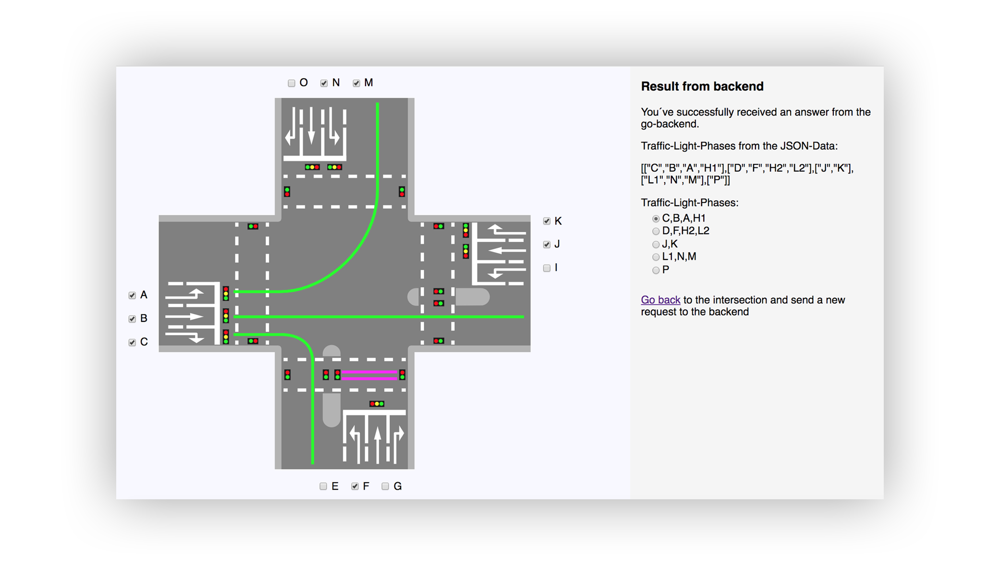

# Optimization of Trafficlight-Circuits [](https://travis-ci.com/ob-algdatii-ss19/leistungsnachweis-ateam)

This webapp calculates the different non-conflicting traffic-light-phases of a given intersection.



## Getting Started

### Prerequisites

* requires the go-lang version 1.12 or greater

If you haven´t installed go-lang yet, go to https://golang.org/dl/ and download the latest version.

### Installing and Running

```
cd $HOME/go/src/github.com/ob-algdatii-ss19
git clone https://github.com/ob-algdatii-ss19/leistungsnachweis-ateam.git
cd leistungsnachweis-ateam
go run main.go
```

* After running the app open it in your browser ```localhost:8080```
* Select your lanes and an algorithm
* Hit the "Evaluate"-Button
* On the result page you can display all lanes of a traffic-light-phase by selecting a radio-box

## Development

### Build status

develop: [](https://travis-ci.com/ob-algdatii-ss19/leistungsnachweis-ateam)

master: [](https://travis-ci.com/ob-algdatii-ss19/leistungsnachweis-ateam)

### Runnig Tests and determine Test-Coverage

Determine testcoverage on your local machine and display results in the browser:
```
go test ./... -v -coverpkg=./... -coverprofile=cover.out
go tool cover -html=cover.out
```

### Heroku

The develop- and master-branch will be automatically deployed to heroku.

[heroku-master](https://leistungsnachweis-ateam.herokuapp.com): 

[heroku-develop](https://leistungsnachweis-ateam-dev.herokuapp.com): 

### Debugging

* To see javascript logging, open the developertools in your browser. In the console you can find the logging output of the js-scripts.
* The go webserver is also printing log-messages on the console

### Authors

Groupname: ateam
