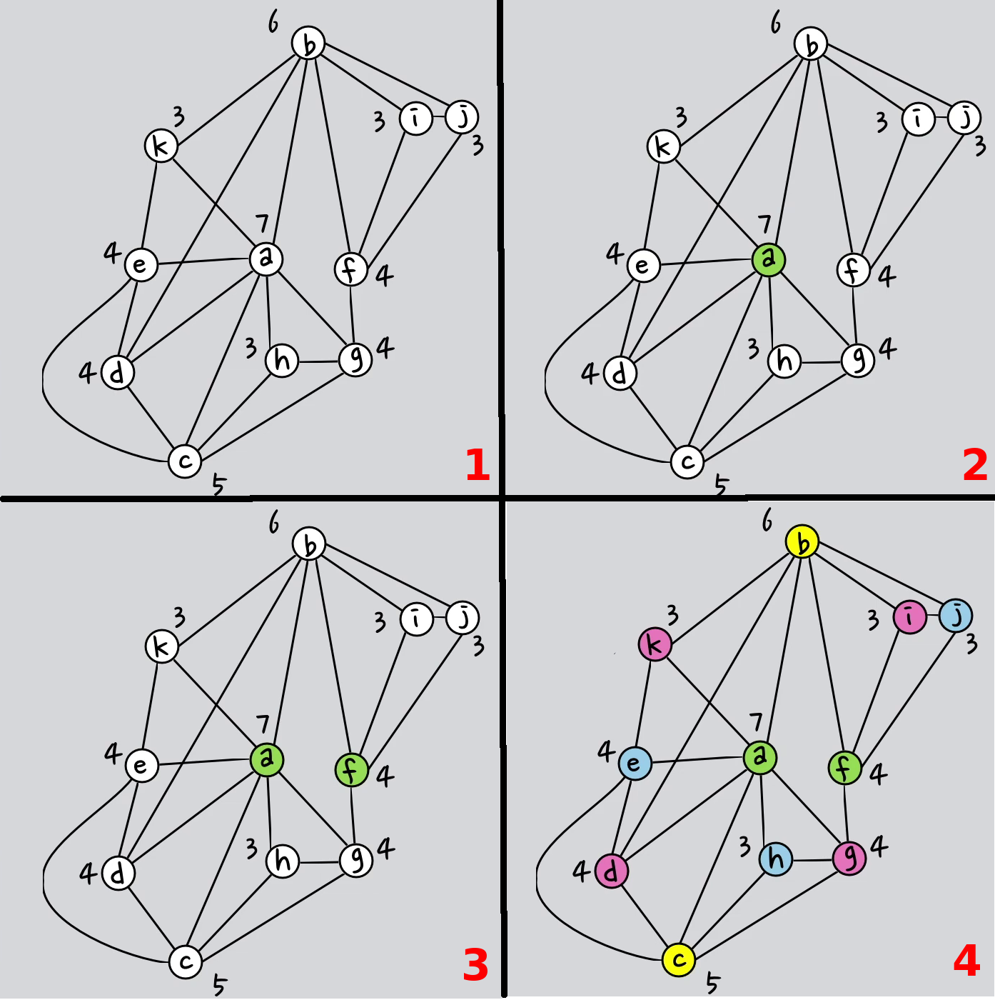

**[Home](./)** **&#124;** **[Alogrithms](./algorithms.html)** **&#124;** **[Architecture](./architecture.html)**

# Description of the algorithms

For modeling the intersection in the backend with its traffic lanes and pedestrian crossings
we used a conflict graph. Each node represents a lane on the intersection.
If the cars of two lanes can´t drive at the same time, because their lanes
cross each other, the conflict graph has an edge between this to nodes.

By coloring the graph it is possible to retrieve all nodes which can drive at the same time.
With Basic Greedy and Welsh Powell we selected two algorithms to color the conflict graph.
Bron Kerbosch is using cliques to retrieve the traffic light phases from a compatibility graph.

The following sections describe the algorithms more detailed:

* [Basic Greedy](#basic-greedy)
* [Welsh Powell](#welsh-powell)
* [Bron Kerbosch](#bron-kerbosch)

## Basic Greedy

The Basic Greedy algorithm is a very easy algorithm for coloring a graph.
The solution heavily depends on the order of the vertices.
Furthermore Basic Greedy does not deliver a colored graph with minimum number of colors.

```
1. Color first vertex with first color.
2. Do following for remaining V-1 vertices.
2.1 Consider the currently picked vertex and color it with the
lowest numbered color that has not been used on any previously
colored vertices adjacent to it. If all previously used colors
appear on vertices adjacent to v, assign a new color to it.
```


## Welsh Powell

This algorithm is simular to the Basic Greedy algorithm. 
But the welsh powell algorithm has two speciality:
1. first order the nodes descending by count of edges
2. then find nodes with no conflict and color this in same color

```
1. Order the nodes by conflict graph descending by count of edges
2. Color first vertex (most edges) with first color.
3. Pass through all other nodes. When this node has no conflict with other nodes with same color, color this node in same color
4. Repeat this with all other nodes pending all nodes have colors
```

source: https://www.youtube.com/watch?v=CQIW2mLfG04

## Bron Kerbosch

Description of the algortihm.

[back](./)