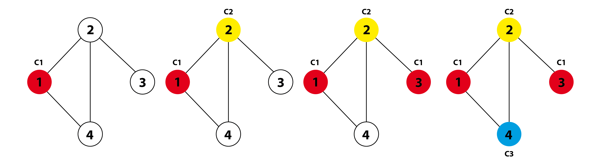

**[Home](./)** **&#124;** **[Algorithms](./algorithms.html)** **&#124;** **[Architecture](./architecture.html)**

# Description of the algorithms

For modeling the intersection in the backend with its traffic lanes and pedestrian crossings
we used a conflict graph. Each node represents a lane on the intersection.
If the cars of two lanes can´t drive at the same time, because their lanes
cross each other, the conflict graph has an edge between this to nodes.

By coloring the graph it is possible to retrieve all nodes which can drive at the same time.
With Basic Greedy and Welsh Powell we selected two algorithms to color the conflict graph.

## Basic Greedy

The Basic Greedy algorithm is a very easy algorithm for coloring a graph.
The solution heavily depends on the order of the vertices.
Furthermore Basic Greedy does not deliver a colored graph with minimum number of colors.

```
1. Color first vertex with first color.
2. Do following for remaining V-1 vertices.
2.1 Consider the currently picked vertex and color it with the
lowest numbered color that has not been used on any previously
colored vertices adjacent to it. If all previously used colors
appear on vertices adjacent to v, assign a new color to it.
```



## Welsh Powell

Description of the algortihm.

## Bron Kerbosch

Despite of the other two algorithms, the Bron-Kerbosch Algorithm relies on a compatibility graph rather than a conflict graph.
It will find all the biggest groups of lanes that are compatible to each other.

It does this by using two principles:
1. ```The recursive backtracking procedure```
   - a efficient recursive search algorithm to go through a graph
   - it does not search for permutations of cliques that have already been found
2. ```The branch- and bound method```
   - if a subtree will not lead to a maximal clique, the search on this branch is to be aborted
Example:


Quelle: http://kontext.fraunhofer.de/haenelt/kurs/folien/Haenelt_Clique.pdf   
   
```
Bron_Kerbosch(list next_possible_expansions, list<node> current_list, list already_tested)
    if current_list.isempty() and already_tested.isempty():
        next_possible_expansion is a maximal clique
    else
        for all nodes v in clique:
            NEW_next_possible_expansions  = next_possible_expansion.append(v)
            NEW_current_list              = current_list    .getNeighbors(v)
            NEW_already_tested            = already_tested  .getNeighbors(v)
            
            Bron_Kerbosch(NEW_next_possible_expansions, NEW_current_list, NEW_already_tested)

            current_list    = current_list.remove(v)
            already_tested  = already_tested.append(v)
```

In our own version we tackled a issue that was making the Bron Kerbosch Algorithm in the original form unusable for our specific Problem:
The Bron Kerbosch gives _all_ the biggest cliques that the graph has to offer. As a result there a many lanes that appear multiple times over in the cliques that are given by the Bron Kerbosch Algorithm.
As we did not want lanes to appear multiple times, we essentially cut out all the doubles and triples afterwards and all the cliques that are unnecessary to the final solution.

[back](./)