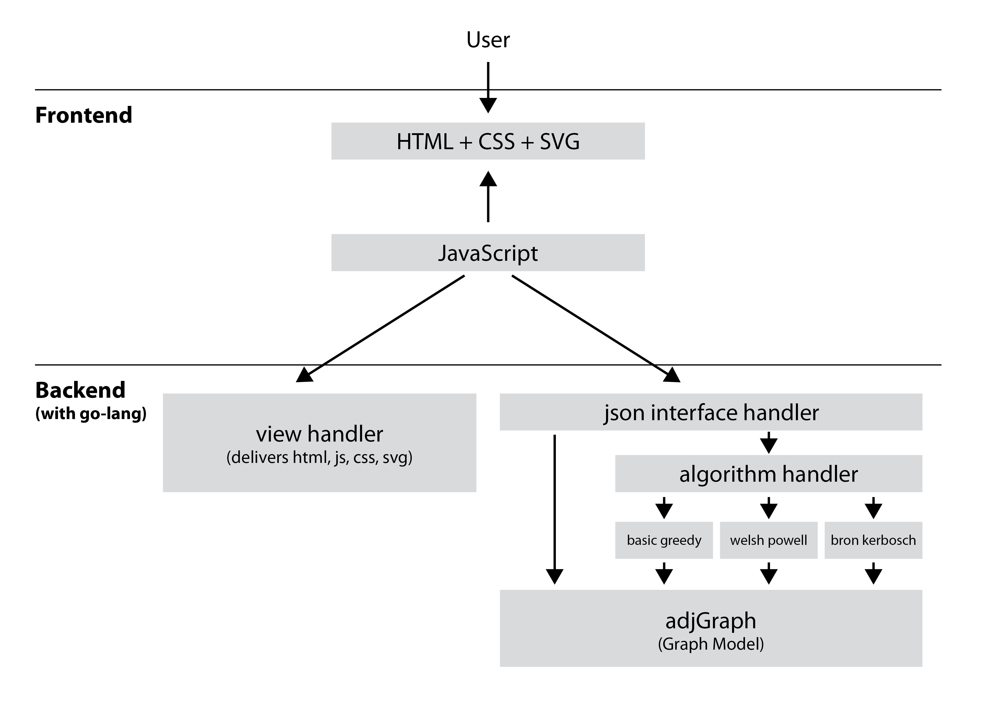

**[Home](./)** **&#124;** **[Algorithms](./algorithms.html)** **&#124;** **[Architecture](./architecture.html)** **&#124;** **[Construction of Conflictgraph](./construction_conflictgraph.html)**

# Description of the architecture and API

## Frontend

The frontend is realized with javascript and svg. The intersection is a
svg-file which can easily be manipulated via javascript. If the user has selected
all his lanes and settings a js-script collects the current state of
the intersection. For exchanging data between frontend and backend we chose JSON.
The JSON-Object contains the all the lanes and the algorithm the user selected.

```
{
	"Settings": {
		"Algorithm": enum //BASIC_GREEDY=0, WELSH_POWELL=1, BRON_KERBOSCH=2
	},
	"Intersection": {
		"Top": {
			"RightLane": boolean,
			"StraightLane": boolean,
			"LeftLane": boolean,
			"Pedestrian": enum //OFF=0, NORMAL= 1, WITH_ISLAND=2
		},
		"Right": {
			"RightLane": boolean,
			"StraightLane": boolean,
			"LeftLane": boolean,
			"Pedestrian": enum //OFF=0, NORMAL= 1, WITH_ISLAND=2
		},
		"Buttom": {
			"RightLane": boolean,
			"StraightLane": boolean,
			"LeftLane": boolean,
			"Pedestrian": enum //OFF=0, NORMAL= 1, WITH_ISLAND=2
		},
		"Left": {
			"RightLane": boolean,
			"StraightLane": boolean,
			"LeftLane": boolean,
			"Pedestrian": enum //OFF=0, NORMAL= 1, WITH_ISLAND=2
		}
	}
}
```

Via AJAX a request with the JSON is sent to the backend.
After receiving the response some parts of the page are replace with the results.
For a better visiualization of the results the user can switch between the
different traffic light phases via radio buttons.

## Backend

The backend is divided in a ```viewHandler``` and a ```jsonInterfaceHandler```.
The ```viewHandler``` delivers all the static files which are requested by the frontend (html-files, css-files and js-files).
Requests to ```/json``` are handled by the ```jsonInterfaceHandler```. The ```algorithmHandler``` forwards the request
to the corresponding graph algorithm.



JSON-Requests get a ```JsonResponse```-Object as response.
The response contains a two-dimensional array.
Each inner-array represents a traffic-light-phase with all the non-conflicting nodes.

```go
type JsonResponse struct {
	ReceivedDataSuccessful bool
	TrafficLightPhases     [][]string
}
```


[back](./)
