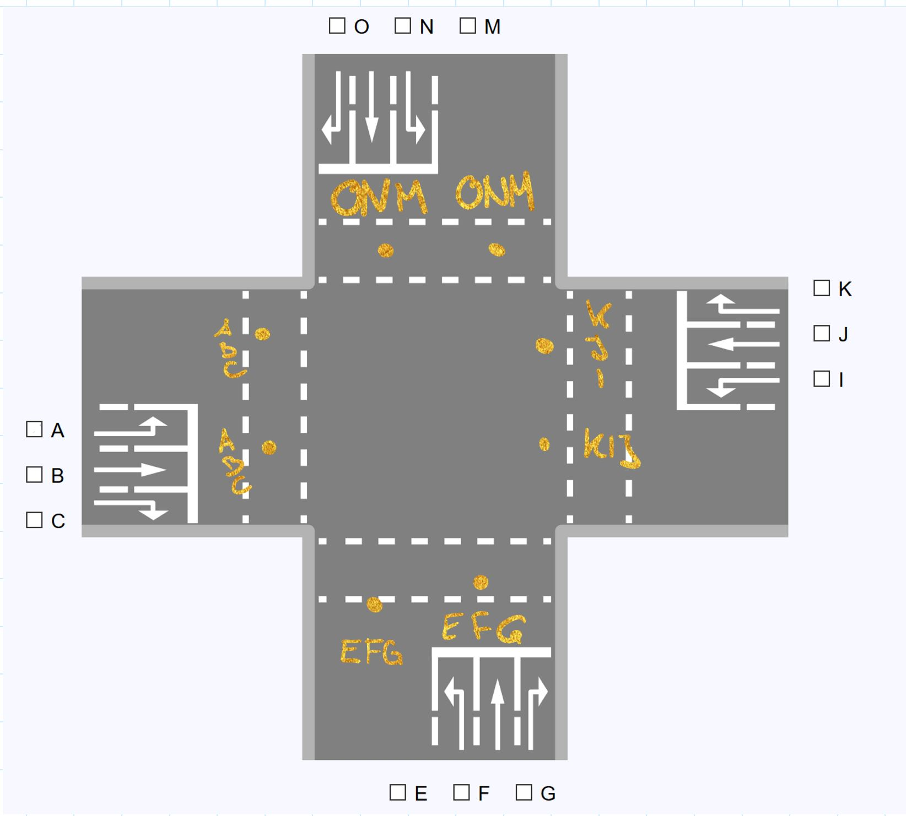
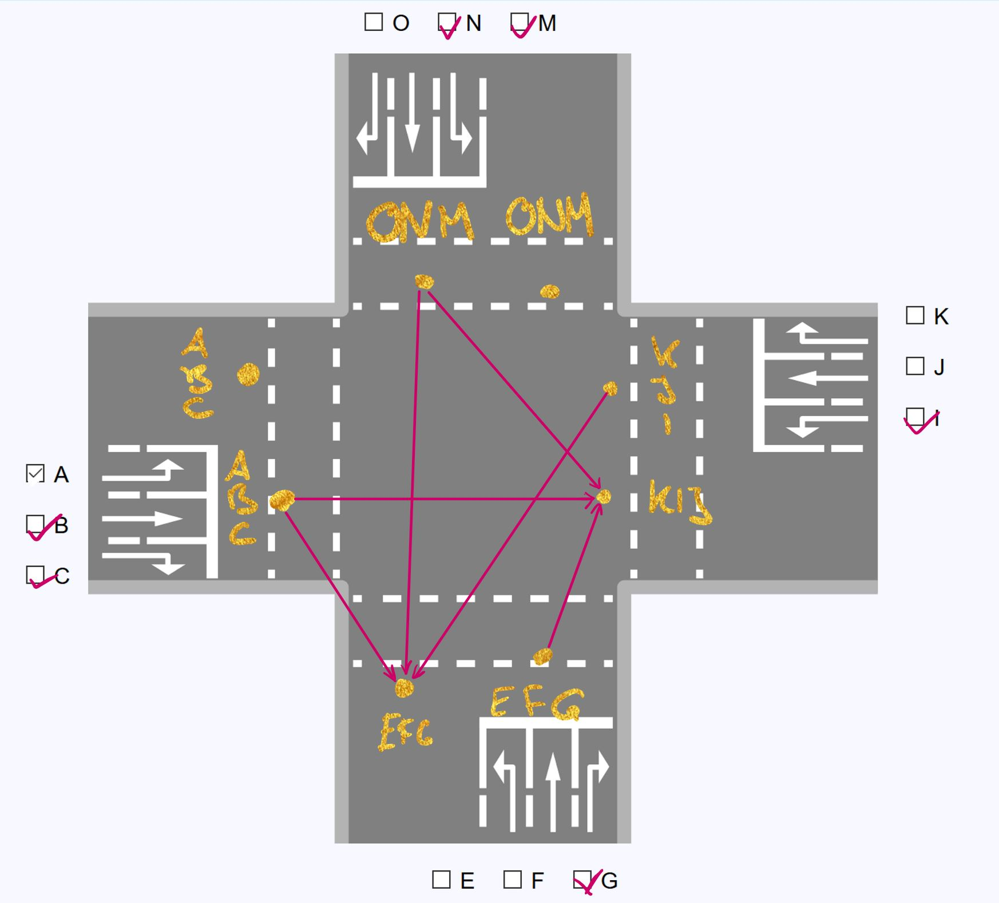
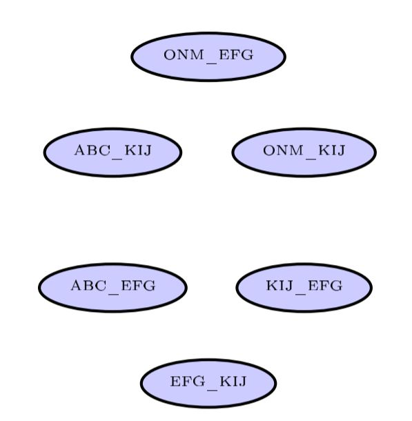
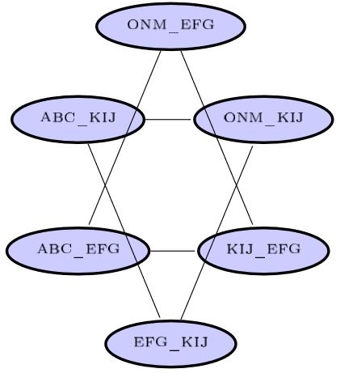
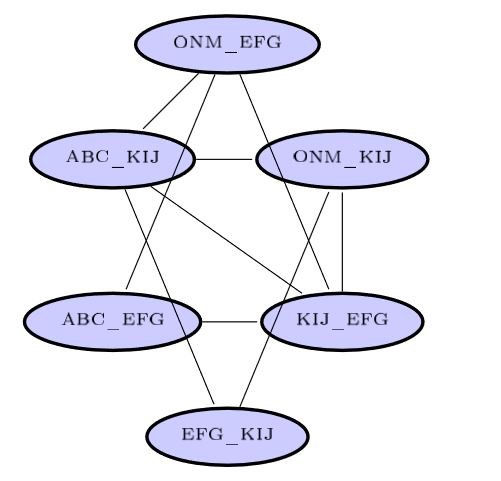
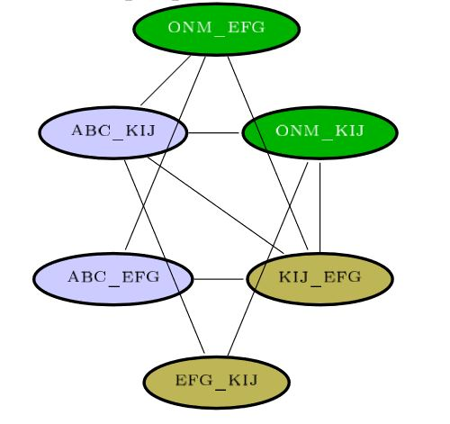
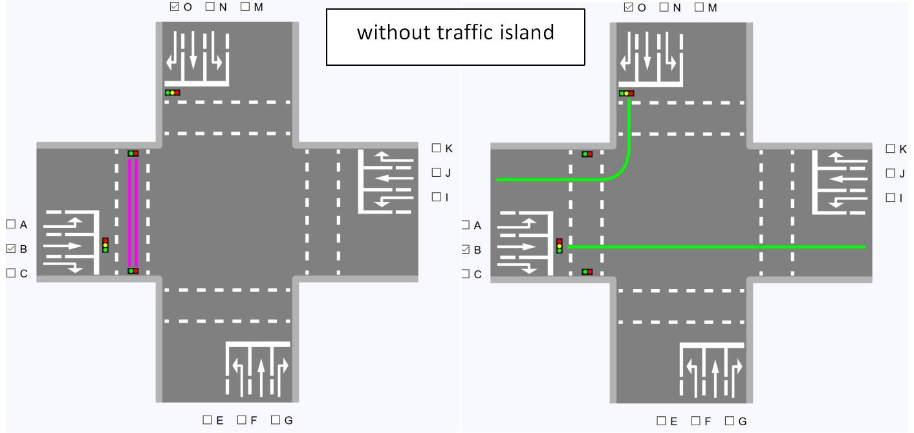
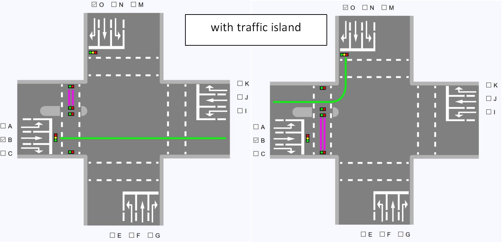

**[Home](./)** **&#124;** **[Algorithms](./algorithms.html)** **&#124;** **[Architecture](./architecture.html)** **&#124;** **[Construction of Conflictgraph](./construction_conflictgraph.html)**

# Why a conflictgraph?

For solving our problem which lanes are able to drive simultaneously, we can create a conflictgraph instead which is representing the crossroad and solve the problem for it through some well known algorithms.
Hereby lanes would cause a possibly dangerous situation on the road if allowed to drive at the same time are marked as a conflictg in the conflictgraph.

# How is a conflictgraph build?

The User may choose which lines the crossroad should contain by selecting lines in the GUI. 



Every lane has a entrance and a departure. Every lane is represented by a node in our Graph and is named by the ```entrance way```_```departure way```
For example if the User chose the checkbox ```A```, this means that the lane will start from the entrance way ```ABC``` and end in the departure way ```MNO```

So now we mark all the conflicts between the lanes. For example if cars would want to enter the same departure way, this could possibly end in a dangerous situation. To avoid this situation, all lanes that end in the the same departure way are marked as conflicts and get a edge in the graph.

In terms of lanes crossing, those that simply turn right are not dangerous for other car lanes as well as those that start at the same entrance way. All the others will cross with another at some time and are therefore also marked as a conflict.

With the resulting graph you can run a algorithm to get the lanes that can drive at the same time.


To include the pedestrians in our scenario, not much has to change. We defined that we wanted our pedestrians to be as safe as possible, so that no car line that would cross their way is allowed to drive simultaneously to them. So each pedestrian crossing which is activated by the user will get their own node in the conflict graph. 
Getting the pedestrians a traffic island means that the road is no longer blocked for both the car lanes that lead in that street and the car lanes that lead out at the same time but instead only one of them.



#Is a Conflict Graph Usable for all these Algorithms

The basic Answer is: No.
We implemented two algorithms- the ```Basic-Greedy-Algorithm``` and the ```Welsh-Powell-Algorithm```- which are both build for coloring in a Conflictgraph. 
The third algorithm, inspired by the ```Bron-Kerbosh- Algorithm```, is in need of the opposite of a conflictgraph- a compatability graph. 
For getting a compatability graph basically all the edges of the Conflictgraph are removed and all the nodes that were not adjacent in the conflict graph will get edges in the comparability graph. 
For more information of the algorithms:
**[To the Algorithms](./algorithms.html)**


[back](./)