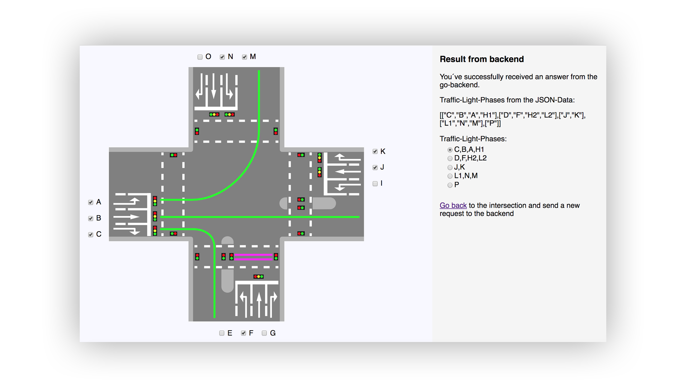

**&#124;** **[Algorithms](./algorithms.html)** **&#124;** **[Architecture](./architecture.html)** **&#124;** **[Construction of Conflictgraph](./construction_conflictgraph.html)**

# Optimization of Trafficlight-Circuits

This webapp calculates the different non-conflicting traffic-light-phases of a given intersection.

The user can create an individual intersection by selecting lanes via checkbox.
For calculating the traffic-light-phases the app offers three different algorithms:
Basic Greedy, Welsh Powell and Bron Kerbosch.
On the result page the user can switch between the different traffic-light-phases.
For each phase all lanes which have green are displayed.

